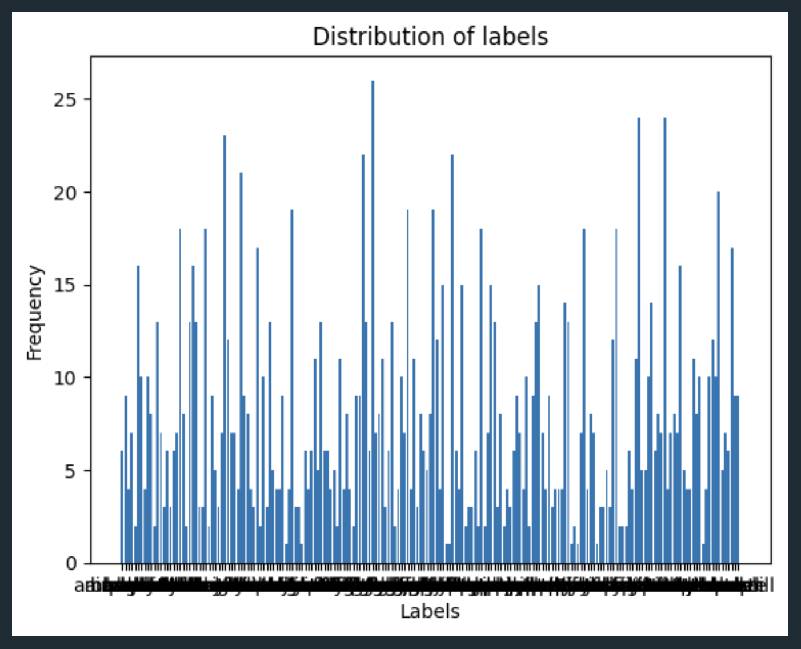
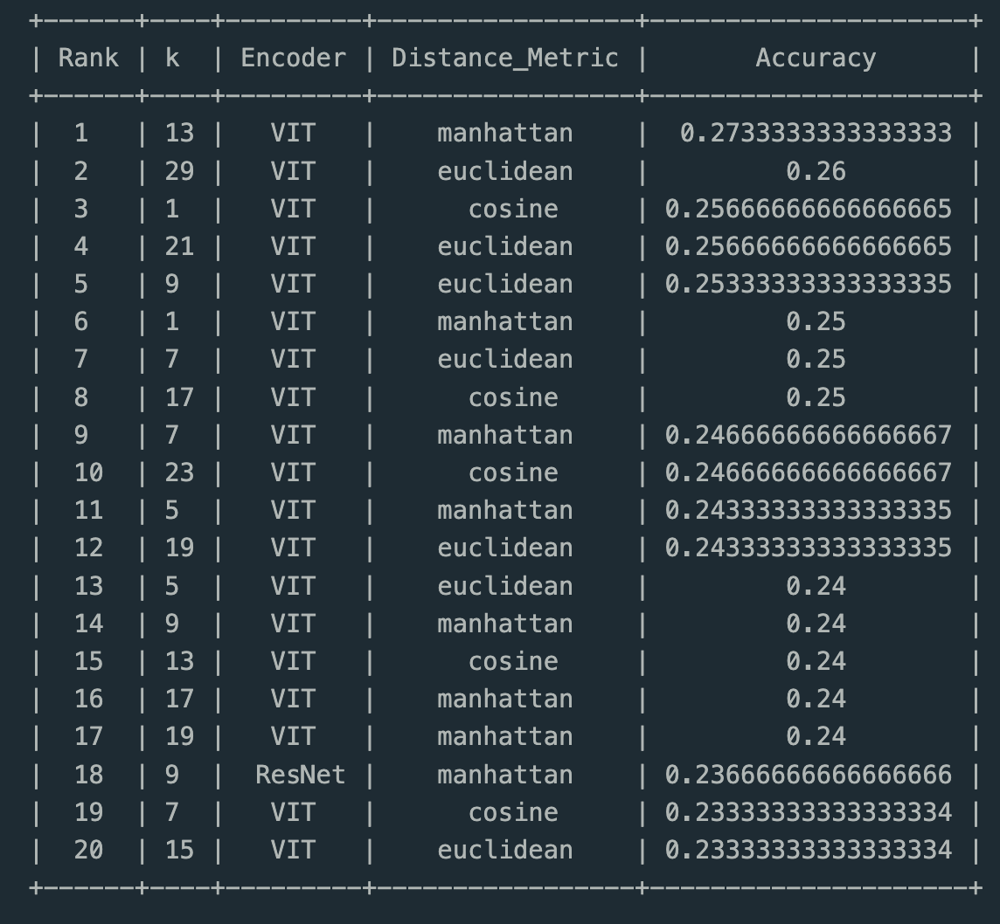
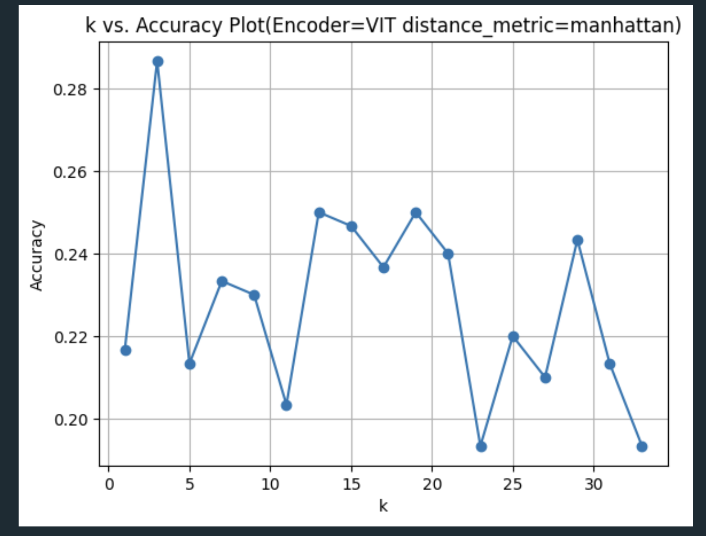
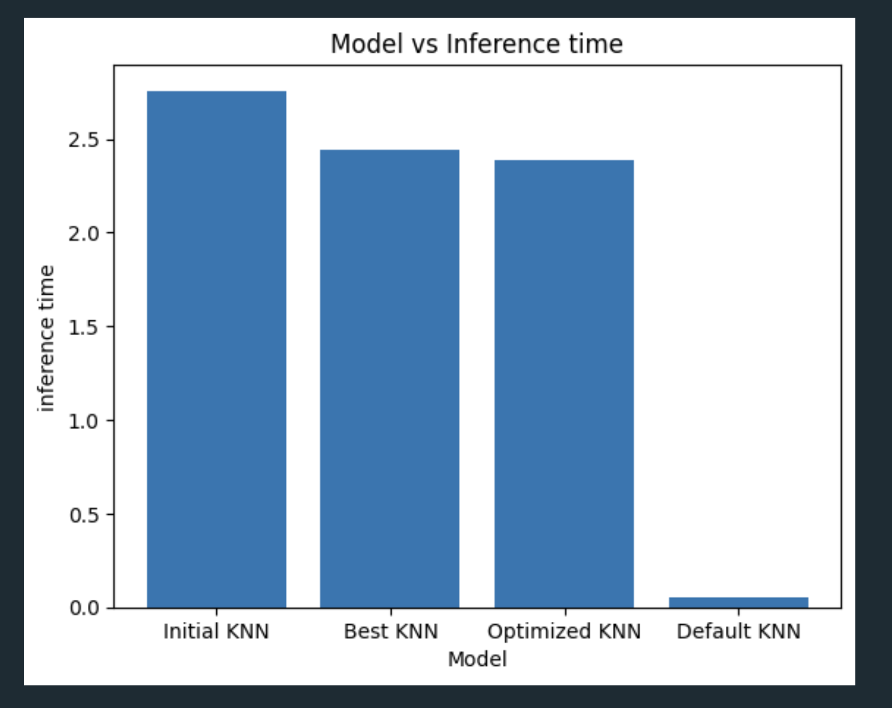
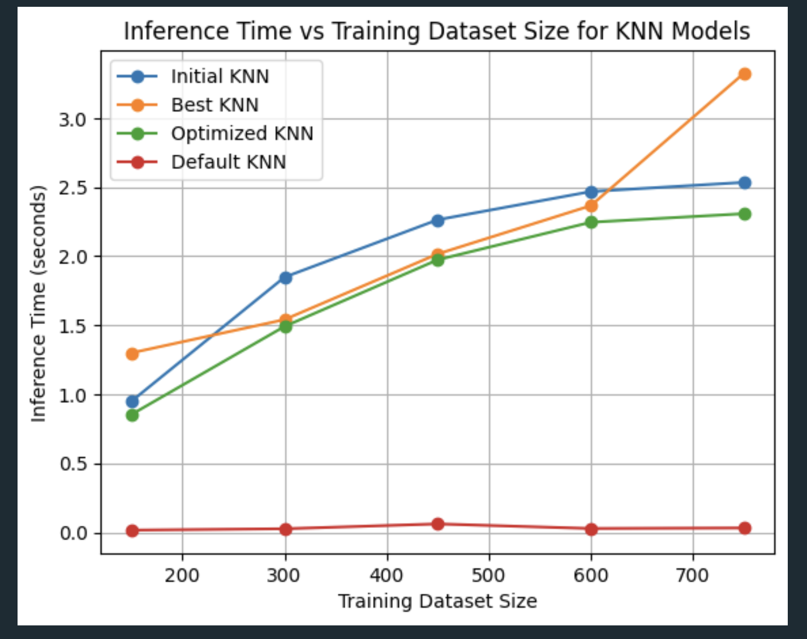
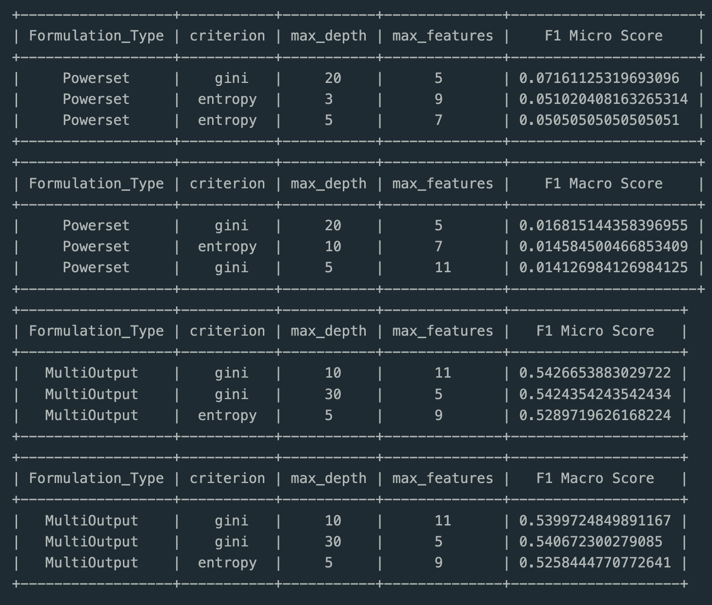
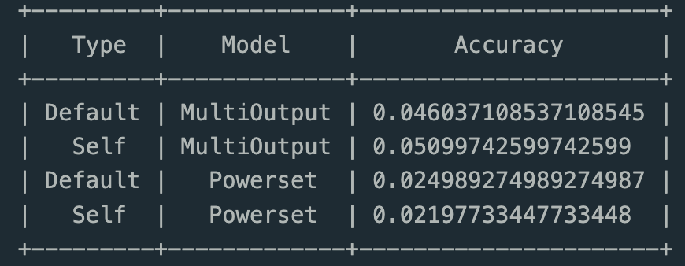

# NAME - Ashish Chokhani

# ROLL NO - 2021102016

# SMAI ASSIGNMENT 1

---

## KNN

- Here we are taking train data as 80 percent of whole data used in `train_test_split`

- For task 2.2.1 we had to know the distribution of data - plotted the count of labels (as the labels are too much the plot is cluttered)

- For task 2.3 a class of knn is made where we can modify or set the hyperparamters of the class . An inference of a point can be made using `class.classiFication` function . For each of the triplet acc , precision , recall , f1_score is printed .

- The best Triplet and top 20 triplets with their accuracy are:

- The plot of k vs accuracy with ("VIT","manhattan") is plotted

- For task 2.5 a bash script is coded which takes the test data set as input which should have the same format as `data.npy` . A python file is also included in this which has the knn class . In the python file the knn class has hyperparameters k = 29 , distMetric = "cosine" , encoder = "ResNet"

- For task 2.6 the initial model is the vectorized model (most optimized one) so for initial model, I calculated its inference time with parameters same as initial 

- For task 2.6.2 Inference time vs different KNN model is plotted

- For task 2.6.3 The training set varies as 200,300,400,500,600,700

---

## DECISION TREES

### DATASCIENCE PRACTICES

- DATA VISUALIZATION - We have observed that the dataset comprises 11 columns, where the 10th column represents the labels associated with each class. This dataset contains a mix of categorical attributes, such as gender and education, as well as numerical attributes, such as income. It's worth noting that some examples in the dataset may have more than one label associated with them, and there are a total of 8 unique labels present.

- DATA PREPROCESSING - We converted the categorical attributes into numerical representations using one-hot encoding. However, for encoding the labels, we employed a custom function that generated binary strings as output. In this binary representation, '1' signifies the inclusion of the corresponding label in the list of labels 

- DATA FEATURIZATION - We've observed that the 'city' attribute contains a substantial number of unique values, approximately 970 in total. Utilizing this attribute for data splitting in a decision tree model tends to result in fragmentation and overfitting. Consequently, we have opted to exclude this attribute from the dataset

- Train Val Test Splitting - The dataset has been divided, with 80 percent allocated to the training set. For the purpose of K-fold cross-validation, the validation sets are drawn from within the training set

### TASKS

- For task 1 all the metrics including the 8 confusion matricies are appended together and printed. Hamming loss is also included for both methods . For power set accuracy is taken as `1 - hamming loss` while for multiouput accuracy is taken as `accuracy_score()` from `sklearn.metrics`

- For 3.4.3, We performed K-fold cross-validation, with K set to 9. In this process, the training data is partitioned into K parts, and the model is trained on K-1 of these partitions while being validated on the remaining 1 partition. The overall accuracy is determined as the average accuracy across all validation splits within the K-fold cross-validation. It's important to note that the best triplet of hyperparameters, based on the F1 macro score, is used in this evaluation. Additionally, we compared the results obtained through this process with those generated by the built-in function cross_val_score().

- For k fold part the refrence taken is from https://www.askpython.com/python/examples/k-fold-cross-validation
and some part from ChatGPT

---
